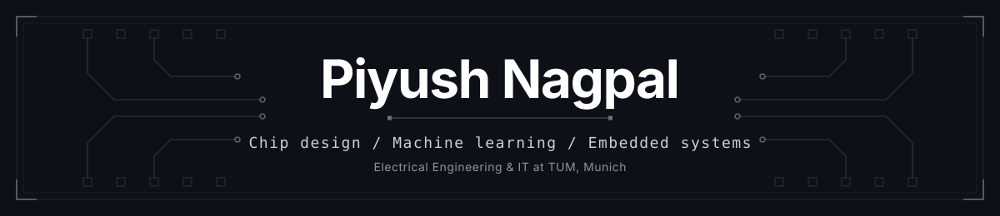
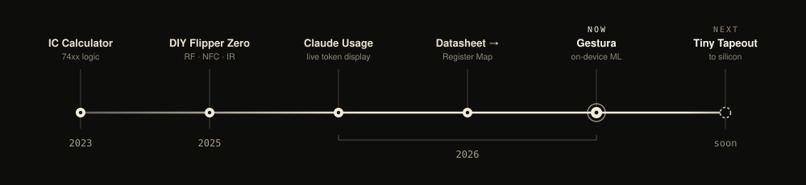

  

---

I like turning ideas into working systems.

I'm studying Electrical Engineering & Information Technology (B.Sc.) at TUM in Munich. I've been building hardware and software since I was 10. I started with C, moved to Python, and then to machine learning.

The direction I'm going in: running ML models directly on small chips, and later designing the chips that run them. Digital IC design, computer architecture and AI hardware.

**Open to Werkstudent, HiWi and internship roles in digital design, embedded ML and AI hardware in Munich.**

---

## Now

**Gestura.** A glove that reads finger movement. Currently getting the gesture model to run on the microcontroller itself. 
**Tiny Tapeout.** Learning Verilog to take my first small digital design to a real chip. 
**The Workbench.** My portfolio, built as an interactive 3D desk.

---

## Projects

Oldest first.

**IC Calculator.** My first real hardware build. A calculator made from two ICs, a binary counter and a clock generator, wired by hand.
&nbsp;&nbsp; 

**Coilgun.** An electromagnetic coilgun with built-in velocity measurement.
&nbsp;&nbsp; 

**DIY Flipper Zero.** One board with a CC1101 sub-GHz radio, a PN532 NFC reader, an IR stage, an OLED and SD-card logging. Tested on our school's cafeteria cards and IR devices, with permission.
&nbsp;&nbsp;   

**Stratoflights.** School stratosphere balloon project. I'm responsible for all the onboard electronics: sensors, power supply and data logging.
&nbsp;&nbsp; 

**ML projects.** Regression and classification with XGBoost, Random Forest and MLPs, and time-series forecasting of CO2 data with SARIMAX. Tuned with GridSearchCV.
&nbsp;&nbsp;  

**Claude Usage Display.** An ESP8266 with an OLED that shows my live Claude token usage and when the limit resets.
&nbsp;&nbsp;  

**Datasheet → Register Map.** Reads a chip's datasheet PDF and generates a register map and a driver from it.
&nbsp;&nbsp;  

**Gestura** *(capstone)*. Six IMUs on a glove: a XIAO nRF52840 Sense plus five MPU-6050s on an I2C mux, fused with a Madgwick filter and streamed over BLE to a web dashboard with a 3D hand model. Next step is training the gesture model and running it fully on the microcontroller, so the glove turns gestures into text on its own.
&nbsp;&nbsp;   

**Tiny Tapeout** *(next)*. Taking a small digital design all the way to fabricated silicon.
&nbsp;&nbsp;  

---

## Timeline

---

## Stack

**Embedded**

**ML**

**Web**

**Learning**

---

## Background

Abitur 1.4 (Maths, Physics, Chemistry). Olympiad participant in maths, physics and chemistry. DPG, DMV and GDCh prizes, Ferry-Porsche-Preis, e-fellows scholarship. CS50x.

Outside of engineering: licensed table tennis coach (DTTB), still training most weeks. Chess and strength training.

 

Reach me at <a href="mailto:nagpal.2352@gmail.com">nagpal.2352@gmail.com</a>

---

&nbsp;

